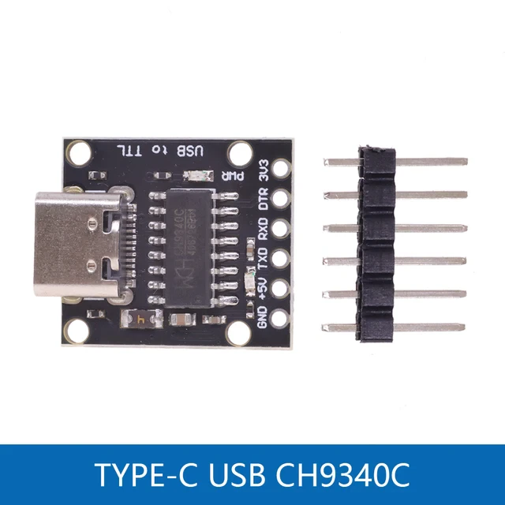
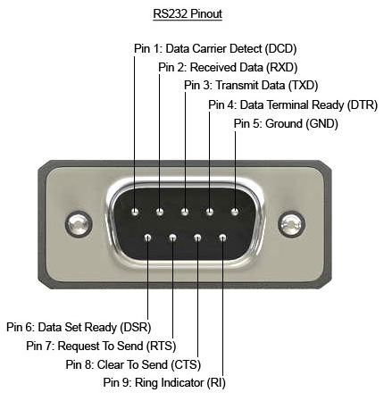
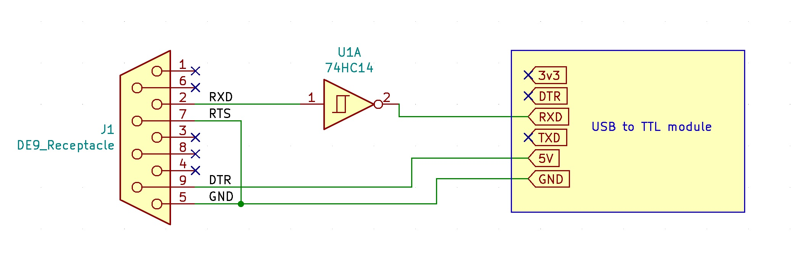
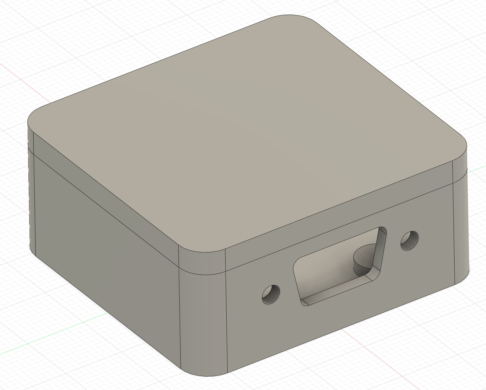
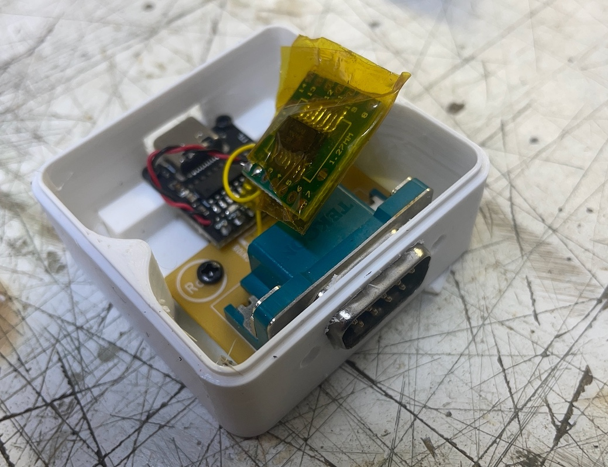

# UNI-T UT61E RS232 serial interface cable to USB

## Instructions
Connect RTS to ground(Pin 5 and Pin 7), DTR to 5V or 3.3V and invert the output with 74hc14 and you have TTL output. This will work at 5V and 3.3V.

## Schematic

## Enclosure

## Assembly

## Windows Software
Install CH430 driver, reboot
[UNI-T-61E-ver-41.zip](UNI-T-61E-ver-41.zip)